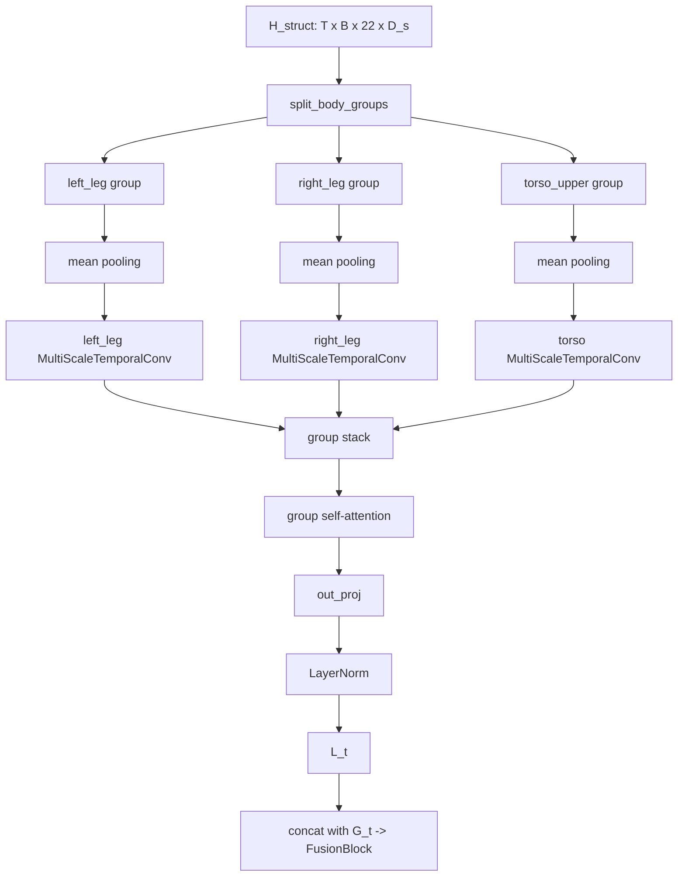

# 2026.5.18 local_v2_shared_gate 改进记录

## 背景

今天补充检查了 `no_local` 消融：

```text
checkpoints/plan_one_ablate_no_local/model000200000.pt
checkpoints/plan_one_ablate_no_local/motion_quality_target_000200000_seed10_n100/results.npy
```

配置：

```text
arch = plan_one
plan_one_local_mode = zero
plan_one_refine_mode = full
seed = 10
checkpoint = 200000
motion_quality samples = 100
```

和 baseline / full plan_one / no_refine 对齐后的关键指标：

```text
metric                  baseline     full        no_refine   no_local
local_jerk_mean          0.00646     0.00741     0.00915     0.00680
local_jerk_p95           0.02342     0.02563     0.03413     0.02343
normalized_jerk          0.32500     0.41763     0.42517     0.45211
foot_sliding             0.01101     0.01306     0.01284     0.00913
leg_range_asymmetry      0.06434     0.09109     0.07244     0.05818
leg_motion_symmetry      0.93566     0.90891     0.92756     0.94182
no_contact_ratio         0.05124     0.05378     0.11803     0.13271
step_timing_cv           0.61888     0.59843     0.66191     0.68108
step_timing_score        0.56414     0.56606     0.53160     0.53099
contact_alternation      0.26602     0.30906     0.33864     0.30321
```

相对 full plan_one：

```text
local_jerk_mean      -8.20%    更好
local_jerk_p95       -8.61%    更好
foot_sliding        -30.05%    明显更好
leg_range_asymmetry -36.13%    明显更好
leg_motion_symmetry  +3.62%    更好

no_contact_ratio   +146.76%    明显更差
step_timing_cv      +13.81%    更差
step_timing_score    -6.20%    更差
```

补充图已保存：

```text
output/motion_quality_no_local_ablation_table_n100.png
```

当前判断：

```text
local branch 很可能是 leg asymmetry / foot sliding / 绝对 jerk 变差的主要来源之一。
但是 local branch 也在提供脚接触/步态时序收益。
不能简单删除 local；下一版应该保留 local 的 contact/timing 能力，同时限制它破坏左右腿一致性和脚部稳定性的自由度。
```

注意：本项目当前使用自定义关节标号，不是官方 HumanML 左右腿标号。因此本次不改 body group 索引。

当前 custom convention 保持为：

```text
left_leg  = [2, 5, 8, 11]
right_leg = [1, 4, 7, 10]
torso_upper = [0, 3, 6, 9, 12, 13, 14, 15, 16, 17, 18, 19, 20, 21]
```

## local_v2_shared_gate 方案

新增 local 模式：

```text
--plan_one_local_mode shared_gate
```

目标：

```text
保留 full plan_one 中 local branch 对 no_contact_ratio / contact timing 的帮助；
同时尽量接近 no_local 在 foot_sliding 和 leg symmetry 上的收益。
```

这一版只改 local branch 的表达自由度，不改数据关节索引。

## 结构流程图

原始 full local：



新的 `shared_gate` local：

```mermaid
flowchart TD
    H[H_struct: T x B x 22 x D_s] --> Split[split_body_groups]
    Split --> L[left_leg group]
    Split --> R[right_leg group]
    Split --> T[torso_upper group]

    L --> PoolL[mean pooling]
    R --> PoolR[mean pooling]
    T --> PoolT[mean pooling]

    PoolL --> SharedLeg[shared leg MultiScaleTemporalConv]
    PoolR --> SharedLeg
    PoolT --> TorsoConv[torso MultiScaleTemporalConv]

    SharedLeg --> Stack[group stack]
    TorsoConv --> Stack

    Stack --> NoAttn[group_stack_attn = group_stack]
    NoAttn --> Proj[out_proj]
    Proj --> Norm[LayerNorm]
    Norm --> PreGate[L_t_pre_gate]
    PreGate --> Gate[local_gate = sigmoid(param) x 0.25]
    Gate --> Lt[L_t = local_gate x L_t_pre_gate]
    Lt --> Fusion[concat with G_t -> FusionBlock]
```

## 代码改动细节

### 1. local_branch.py

文件：

```text
model/plan_one/local_branch/local_branch.py
```

新增 `variant` 参数：

```python
def __init__(self, d_struct: int, d_model: int, dropout: float = 0.1, variant: str = 'full'):
```

支持两个 variant：

```text
full         保持旧结构，用于兼容已有 full checkpoint
shared_gate  新 local_v2 结构
```

`full` 路径保持原样：

```text
left_leg  -> 独立 MultiScaleTemporalConv
right_leg -> 独立 MultiScaleTemporalConv
torso     -> 独立 MultiScaleTemporalConv
3 group tokens -> GroupSelfAttention -> out_proj -> LayerNorm -> L_t
```

`shared_gate` 路径新增：

```text
left_leg/right_leg 共用 self.leg_temporal
torso_upper 使用 self.torso_temporal
不再调用 GroupSelfAttention
out_proj + LayerNorm 后得到 L_t_pre_gate
L_t = local_gate * L_t_pre_gate
```

gate 设置：

```python
self.local_gate_max = 0.25
self.local_gate_logit = nn.Parameter(torch.tensor(-1.3862944))
local_gate = torch.sigmoid(self.local_gate_logit) * self.local_gate_max
```

初值含义：

```text
sigmoid(-1.3862944) = 0.2
0.2 * 0.25 = 0.05
```

因此训练初期 local 只以 5% 强度进入 fusion，后续最大也只能到 25%。

输出字典额外保留：

```text
l_t_pre_gate
local_gate
```

方便后续 logging / 诊断 local 实际强度。

### 2. mdm_plan_one.py

文件：

```text
model/plan_one/mdm_plan_one.py
```

允许 `local_mode` 新值：

```python
if local_mode not in ('full', 'zero', 'shared_gate'):
```

根据 `local_mode` 选择 local branch variant：

```python
local_branch_variant = 'shared_gate' if local_mode == 'shared_gate' else 'full'
self.local_branch = LocalBranch(..., variant=local_branch_variant)
```

forward 中：

```python
if self.local_mode in ('full', 'shared_gate'):
    local_outputs = self.local_branch(shared_outputs['h_struct'])
elif self.local_mode == 'zero':
    local_outputs = {'l_t': torch.zeros_like(global_outputs['g_t'])}
```

这样旧模式完全保留：

```text
full   旧 local branch
zero   no_local 消融
shared_gate 新 local_v2
```

### 3. parser_util.py

文件：

```text
utils/parser_util.py
```

命令行选项从：

```text
choices=['full', 'zero']
```

扩展为：

```text
choices=['full', 'zero', 'shared_gate']
```

## 当前未改的部分

没有修改：

```text
model/plan_one/local_branch/body_groups.py
model/plan_one/global_branch/group_summary_builder.py
model/plan_one/shared_embedding/structure_adapter.py
```

原因：

```text
当前数据使用自定义左右关节序列。
local/global group 的索引要保持项目当前 convention。
本次问题定位在 local branch 表达自由度，而不是重新定义关节编号。
```

## 验证结果

轻量 forward 检查：

```text
LocalBranch(variant='shared_gate') forward OK
l_t shape = [60, 2, 512]
local_gate = 0.0500000007
group_stack_attn shape = [60, 2, 3, 256]
```

完整 PlanOneMDM 检查：

```text
PlanOneMDM(local_mode='shared_gate') forward OK
y_pred shape = [2, 263, 1, 60]
local_gate = 0.0500000007
group_stack shape = [60, 2, 3, 32]
```

`python -m py_compile` 没有完成，原因不是语法，而是当前 Windows 环境拒绝写 `__pycache__`：

```text
PermissionError: __pycache__/local_branch.cpython-38.pyc
```

已用 `PYTHONDONTWRITEBYTECODE=1` 做 import 和 forward 检查替代。

## 下一组训练命令

建议新实验目录：

```text
checkpoints/plan_one_local_v2_shared_gate
```

训练命令：

```powershell
python -m train.train_mdm ^
  --save_dir checkpoints\plan_one_local_v2_shared_gate ^
  --dataset humanml ^
  --batch_size 128 ^
  --arch plan_one ^
  --text_encoder_type clip ^
  --plan_one_local_mode shared_gate
```

评估时仍按当前 motion quality 对齐：

```text
baseline:
checkpoints/baseline_trans_enc/motion_quality_baseline_000200000_seed10_n100/results.npy

full:
checkpoints/plan_one_warmup_gate_rec/motion_quality_target_000200000_seed10_n100/results.npy

no_refine:
checkpoints/plan_one_ablate_no_refine/motion_quality_target_000200000_seed10_n100/results.npy

no_local:
checkpoints/plan_one_ablate_no_local/motion_quality_target_000200000_seed10_n100/results.npy

local_v2_shared_gate:
checkpoints/plan_one_local_v2_shared_gate/motion_quality_target_000200000_seed10_n100/results.npy
```

## local_v2 的判定标准

优先观察：

```text
foot_sliding
leg_range_asymmetry
leg_motion_symmetry
local_jerk_mean
local_jerk_p95
normalized_jerk
no_contact_ratio
step_timing_cv
step_timing_score
contact_alternation
```

理想结果：

```text
foot_sliding 接近 no_local，至少明显优于 full
leg_range_asymmetry 接近 no_local，至少明显优于 full
leg_motion_symmetry 接近 no_local，至少明显优于 full
no_contact_ratio 明显优于 no_local，尽量接近 full
step_timing_cv / step_timing_score 不要像 no_local 那样恶化
local_jerk_mean / local_jerk_p95 不应比 full 更差
```

如果结果成立：

```text
说明 local branch 本身有价值，但旧版 local 太自由。
左右腿独立 temporal conv + group self-attention + 无上限 local 注入，是 leg asymmetry / foot sliding 的主要结构嫌疑。
后续可以继续从 local gate、per-group gate、foot-aware local mask 方向推进。
```

如果结果不成立：

```text
如果 foot_sliding / leg asymmetry 仍然差，问题可能不只在左右腿 temporal 参数独立，还可能在 fusion 或 shared embedding 的局部速度/foot contact 表达。
如果 no_contact_ratio 仍然像 no_local 一样差，说明 local 的接触收益可能依赖旧版更强的 group attention 或更大 local 强度，需要逐项恢复做扫描。
```

## 2026.5.21 shared_gate 评测复盘

已检查：

```text
checkpoints/plan_one_local_v2_shared_gate/model000200000.pt
checkpoints/plan_one_local_v2_shared_gate/motion_quality_target_000200000_seed10_n100/results.npy
checkpoints/plan_one_local_v2_shared_gate/motion_quality_target_000200000_seed10_n100/motion_quality_eval_summary.json
```

当前 `shared_gate` 的关键结果：

```text
metric                  baseline     full/warmup  shared_gate
foot_sliding             0.01101     0.01306      0.00938
contact_height_var       0.000224    0.000195     0.000188
local_accel_mean         0.00723     0.00791      0.00688
local_jerk_mean          0.00646     0.00741      0.00689
local_jerk_p95           0.02342     0.02563      0.02529
normalized_jerk          0.32500     0.41763      0.51628
no_contact_ratio         0.05124     0.05378      0.10577
step_timing_cv           0.61888     0.59843      0.76362
step_timing_score        0.56414     0.56606      0.48649
leg_motion_symmetry      0.93566     0.90891      0.94059
right_contact_ratio      0.83739     0.80321      0.77017
left_contact_ratio       0.82787     0.80940      0.80697
```

结论：

```text
shared_gate 确实解决了本轮最想压的部分问题：
- foot_sliding 明显下降
- local_accel_mean 下降
- leg_motion_symmetry 恢复到 baseline 附近

但它引入了新的明显副作用：
- no_contact_ratio 接近 full/warmup 的 2 倍
- step_timing_score 明显下降
- normalized_jerk 明显升高
- right_contact_ratio 继续下降
```

因此当前判断不是 `local` 方向失败，而是出现了明确 tradeoff：

```text
local 被限制后能降低脚滑和一部分局部抖动，
但模型可能通过减少脚接触/破坏接触节奏来规避 foot_sliding。
```

## gate 实际值检查

从 `model000200000.pt` 读取到：

```text
local_branch.local_gate_logit = -0.255265
effective local_gate = sigmoid(logit) * 0.25 = 0.109132

global_branch.summary_fusion.gate_logit = -2.145216
raw summary_gate = 0.104779

residual_tcn.gate_logit = -1.603017
raw residual_gate = 0.167560
```

说明：

```text
这版并不是没有控制 local 进入 fusion。
local 已经使用 capped scalar gate，且训练后 effective local_gate 从初始约 0.05 学到约 0.109。

问题在于 scalar gate 只能控制 local 的整体幅度，不能控制 local 在哪些关节、哪些通道、哪些接触阶段生效。
```

当前 fusion 仍是：

```text
fused = concat([l_t, g_t])
f_t = LayerNorm(Linear(fused))
```

因此：

```text
local gate 不是硬约束。
后续 Linear + LayerNorm 仍可能重新放大 local 相关方向。
全局 scalar gate 不能表达“脚接触阶段不要破坏 foot/contact timing，但其它局部信息可以进入”。
```

## 下一步计划：同 checkpoint 推理级 local gate 消融

优先不重训，先用同一个 checkpoint 做推理级扫描：

```text
checkpoint:
checkpoints/plan_one_local_v2_shared_gate/model000200000.pt

固定：
seed = 10
n = 100
motion_quality 评测口径与当前结果一致

扫描 local_gate：
0
0.05
0.10
当前学习值 0.109132
```

目的：

```text
验证 no_contact_ratio / step_timing_score / foot_sliding 是否随 local_gate 单调或近似单调变化。
如果 local_gate 增大时 foot_sliding 下降、no_contact_ratio 上升，则基本坐实副作用来自 local 进入 fusion 后的接触规避。
如果 local_gate 扫描不解释 no_contact_ratio，则需要继续检查 residual_tcn、fusion projection 或 base head。
```

优先观察指标：

```text
foot_sliding
no_contact_ratio
left_contact_ratio
right_contact_ratio
double_support_ratio
step_timing_cv
step_timing_score
local_accel_mean
local_jerk_mean
local_jerk_p95
normalized_jerk
leg_motion_symmetry
```

预估耗时：

```text
n=100、4 个 gate 点，不需要重训。
总耗时约为当前一次 n=100 生成+motion_quality 评测的 4 倍。
如果时间紧，可以先跑 3 个点：0 / 0.05 / 当前 0.109132。
```

如果推理级消融确认 local gate 是主因，后续结构改动优先级：

```text
1. local scalar gate 改成 per-group gate：left_leg / right_leg / torso_upper。
2. 脚相关通道或 foot/contact 相关路径单独 gate 或限幅。
3. fusion 前后增加 contact-preserving 约束，避免模型通过减少接触来降低 foot_sliding。
4. 再考虑 per-channel gate 或 contact-aware temporal mask。
```
