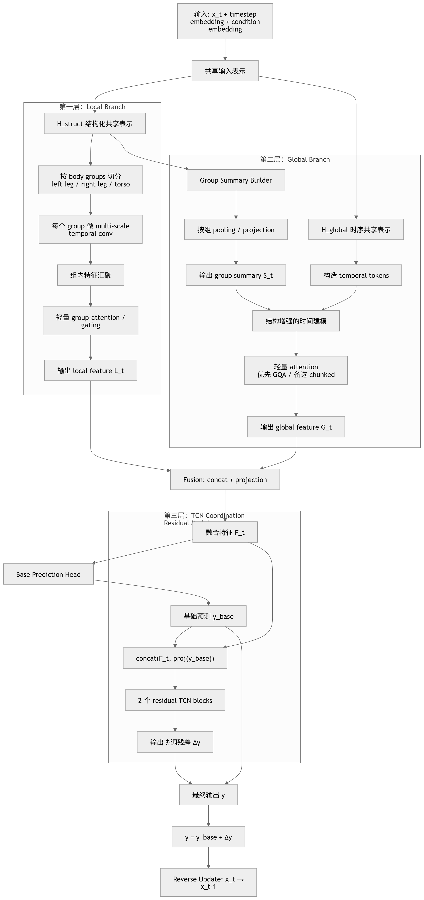

# 方案一 Pipeline 整理版

## 三层结构图



## 1. 方法概述

方案一面向 MDM 在人体动作生成任务中存在的协调性不足与自然性欠佳问题，目标是在保留原始扩散生成框架的前提下，对单步去噪器进行结构化增强。当前 baseline 在生成行走、摆臂或躯干参与较强的动作时，容易出现左右肢体节奏不一致、局部补偿动作不自然、整体轨迹后程偏移等现象。这说明仅沿时间维度做统一建模，虽然可以恢复动作的大体轮廓，但对局部身体结构与整体运动趋势之间的协同刻画仍然不够充分。

基于这一观察，方案一将单步去噪过程拆成三层互补结构：

- `Local Branch` 负责局部身体组动态建模。
- `Global Branch` 负责整体时序趋势建模。
- `TCN Coordination Residual Module` 负责输出端的协调残差修正。

整个设计保持 MDM 的扩散采样流程不变，只重构每个 reverse step 内部的去噪器结构。核心思想不是替换原有主干，而是在单步预测时显式区分“局部动作是否协调”“全局趋势是否稳定”以及“输出结果是否还需要细粒度修正”这三类问题。

## 2. 整体生成流程

方案一仍遵循标准的扩散生成过程。文本条件或动作类别条件首先经过 `Text Encoder / Action Embedding` 得到条件嵌入；当前带噪动作表示 `x_t` 与 timestep embedding、condition embedding 一起进入单步去噪器，经过共享表示、局部分支、全局分支、融合、基础预测与残差修正，得到当前步输出 `y`，再用于 reverse update 得到 `x_{t-1}`。

从结构图来看，单步去噪器的计算路径可以概括为：

```text
x_t + timestep embedding + condition embedding
-> shared embedding H_t
-> Local Branch / Global Branch
-> fusion(F_t)
-> Base Prediction Head
-> y_base
-> TCN Coordination Residual Module
-> Δy
-> y = y_base + Δy
-> reverse update: x_t -> x_{t-1}
```

因此，方案一的改动重点不在扩散框架本身，而在单步去噪器内部如何把局部建模、全局建模和后端协调修正组织成更清晰的功能分工。

## 3. 单步去噪器设计

### 3.1 共享输入表示

在每个 reverse step 中，模型接收当前状态 `x_t`、timestep embedding 和 condition embedding，并通过共享嵌入层得到统一表示 `H_t`。`H_t` 是后续局部分支和全局分支的共同输入，其作用是把扩散状态、时间信息和条件信息先对齐到同一特征空间，避免两个分支直接在原始输入上各自学习、导致表示空间偏移过大。

这一层的职责应保持简单明确：提供一个稳定、统一、可被双分支复用的中间表示，而不是在这里就预先承担局部协调或长程依赖建模任务。

### 3.2 Local Branch

`Local Branch` 的目标是增强模型对局部身体结构动态的刻画能力。根据当前结构图，局部分支的设计已经明确为一条“先按 body groups 切分，再做组内时序建模和组间轻量交互”的路径，而不是笼统地做一层局部卷积。

当前已确定的处理流程为：

- 按 body groups 将人体简化划分为 `left leg`、`right leg`、`torso` 三组。
- 对每个 group 单独做 `multi-scale temporal conv`。
- 在组内得到时序特征后进行组内特征汇聚。
- 再通过轻量 `group-attention / gating` 建立有限的组间信息交换。
- 输出局部分支特征 `L_t`。

这一设计的含义很明确。方案一并不是希望用复杂骨架图卷积直接覆盖所有结构关系，而是先把最关键、最容易产生协调问题的几类身体区域单独建模，再用轻量机制让这些区域发生交互。这样做有三个直接好处：

- 左右腿与躯干的局部动态被显式拆开，便于捕捉步态不齐、支撑相错位等问题。
- 多尺度时间卷积可以同时覆盖短时节奏变化和稍长时间范围内的局部补偿动作。
- 组间交互控制在 `group-attention / gating` 这一轻量层面，复杂度可控，不会把局部分支重新做成一个重型全局建模器。

因此，`Local Branch` 的输出 `L_t` 应被理解为“带有明确身体组语义的局部动态表示”，而不是普通的局部卷积特征。

### 3.3 Global Branch

`Global Branch` 负责从整体时序角度建模动作趋势与长程依赖。根据结构图，当前设计已经从泛化的“全局建模”进一步收敛为“temporal tokens + group summary + 轻量 attention”的组合。

当前已确定的处理路径为：

- 基于共享表示 `H_t` 构造主时序序列 `temporal tokens`。
- 并行提取一组较粗粒度的 `group summary`。
- 将 `temporal tokens` 与 `group summary` 一起送入“结构增强的时间建模”模块。
- 该模块优先采用轻量 attention，首选 `GQA`，备选 `chunked attention`。
- 最终输出全局分支特征 `G_t`。

这里最关键的收敛点有两个。

第一，主轴仍然是时间建模。也就是说，方案一没有偏离 MDM 原本以时间序列为核心的生成逻辑，`Global Branch` 仍以 temporal tokens 为主体。

第二，`group summary` 被作为结构增强信号插入全局建模，而不是替代时间主轴。这意味着全局分支不再是完全“结构无感”的时间主干，而是能在维持时序建模能力的同时，获得一定的身体组感知。

在实现优先级上，当前文档应明确写死：

- 首选 `GQA`，因为它在保持较强注意力建模能力的同时更节省显存和计算。
- 若实现复杂度或显存预算受限，则退而使用 `chunked attention`。

这样写可以减少后续实现阶段的摇摆，也使方案描述与图中已定结论保持一致。

### 3.4 Fusion

局部分支输出 `L_t`，全局分支输出 `G_t` 后，模型通过融合模块得到统一特征 `F_t`。根据结构图，这里的融合方式已经确定为：

```text
Fusion: concat + projection
```

因此，文档中不再把融合写成开放问题，而应明确表述为先拼接、后投影的固定方案：

```text
F_t = Proj([L_t ; G_t])
```

这样的设计理由是直接且充分的：

- `concat` 能保留局部与全局两类特征的原始语义，不会过早做强耦合。
- `projection` 用于把拼接后的特征重新映射回统一维度，便于后续预测头和残差修正模块复用。

所以 `Fusion` 的角色是“特征对齐与统一表达”，不是再做一层复杂建模。

### 3.5 Base Prediction Head

基于融合特征 `F_t`，模型首先通过 `Base Prediction Head` 输出基础预测 `y_base`。它表示当前 reverse step 下、已经结合局部与全局上下文后的主预测结果。

这里建议文档中明确它的职责边界：

- `Base Prediction Head` 负责主去噪预测。
- 它应输出一个整体上合理、具备基本动作结构和时间趋势的结果。
- 它不负责专门解决输出端的细粒度协调问题，这部分留给后续残差模块。

这种职责拆分很重要。否则如果把所有修正压力都压到主预测头上，优化目标会变得混乱，既不利于训练，也不利于解释各模块贡献。

### 3.6 TCN Coordination Residual Module

在得到基础预测 `y_base` 后，方案一通过 `TCN Coordination Residual Module` 输出协调残差 `Δy`，并与基础预测相加得到最终输出。

根据结构图，这一模块的实现细节已经比原文更明确，当前应直接固定写为：

```text
input = concat(F_t, proj(y_base))
Δy = TCN(input)
y = y_base + Δy
```

其中有三个已确定细节需要明确写入文档。

第一，输入并不是简单的 `[F_t ; y_base]`，而是 `concat(F_t, proj(y_base))`。这意味着 `y_base` 在与融合特征拼接前要先经过一个投影层，以对齐维度与表示空间。

第二，TCN 的主体结构当前定为 `2 个 residual TCN blocks`。这说明该模块被控制在一个轻量、后端、修正型的容量范围内，而不是扩展成新的主生成器。

第三，模块输出的是协调残差 `Δy`，不是完整预测值。最终结果由：

```text
y = y_base + Δy
```

得到。

因此，这个模块的定位应被明确写成：它专门用于修正基础预测中仍残留的局部协调失配、节奏错位和细粒度时序不顺滑问题，尤其关注左右肢体协同、躯干与下肢配合、步态连续性等高频出现的失真模式。

## 4. 三层结构的设计动机

方案一采用三层结构，不是为了增加模块数量本身，而是因为动作生成中的“不自然”通常同时来自三个层面：

- 局部身体组内部的动态模式没有建好。
- 整体时间趋势与长程依赖没有维持好。
- 最终输出虽然大体正确，但仍有细粒度协调误差需要修补。

对应地：

- `Local Branch` 解决“局部身体组是否各自动得合理”。
- `Global Branch` 解决“整体动作是否沿时间方向保持稳定趋势”。
- `TCN Coordination Residual Module` 解决“最终输出是否足够协调、顺滑、自然”。

这种划分的直接收益有两点。一是结构更可解释，后续做消融实验时可以更清晰地区分局部建模、全局建模和残差修正的贡献。二是训练目标更清楚，各模块不需要在同一层同时承担全部功能。

## 5. 当前已明确内容与未决内容

从当前结构图出发，方案一已经明确的内容包括：

- 扩散框架保持不变，改动集中在单步去噪器内部。
- 共享输入通过统一表示 `H_t` 分发到局部分支和全局分支。
- `Local Branch` 采用 `left leg / right leg / torso` 三组划分。
- 每个局部组先做 `multi-scale temporal conv`，再做组内汇聚与轻量 `group-attention / gating`。
- `Global Branch` 采用 `temporal tokens + group summary` 的结构增强式时间建模。
- 全局 attention 优先 `GQA`，备选 `chunked attention`。
- `Fusion` 固定为 `concat + projection`。
- `Base Prediction Head` 先给出基础预测 `y_base`。
- `TCN Coordination Residual Module` 的输入为 `concat(F_t, proj(y_base))`。
- 残差修正主干固定为 `2 个 residual TCN blocks`。
- 最终输出形式固定为 `y = y_base + Δy`。

相较之下，仍可保留为实现细节再行确定的部分主要包括：

- `multi-scale temporal conv` 的具体卷积核组合与 dilation 设置。
- `group-attention / gating` 采用何种最轻量实现更合适。
- `group summary` 的具体汇聚形式，是均值池化、注意力池化还是小型 MLP 汇聚。
- `proj(y_base)` 的维度设置与是否共享投影参数。
- 2 个 residual TCN blocks 的通道数、卷积核大小与归一化方式。

也就是说，方案一的总体结构和大部分模块边界已经收敛，后续需要实验决定的更多是参数化实现，而不是方法逻辑本身。

## 6. 小结

方案一的核心不是改写 MDM 的扩散流程，而是在每个 reverse step 内构造一个清晰的三层去噪结构：局部分支关注身体组动态，全局分支关注结构增强的时间建模，后端 TCN 残差模块负责细粒度协调修正。结合当前结构图，方案一已经从概念性设计进一步收敛到可实现层面，尤其是身体分组、融合方式、全局 attention 优先级以及残差模块输入输出形式都已基本确定。

这使得该方案不仅有明确的研究动机，也具备了较清晰的实现落点，适合作为后续代码改造、模块实验与消融分析的统一方案说明。
